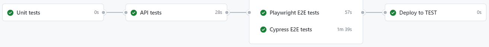

# techProbe

## E-comm project for E2E testing POC with Cypress & Playwright


## Arhitecture

- [Application source](./src)

  - [Frontend](./src/ui)

    - [Home page](./src/ui/index.html)
    - [Cart page](./src/ui/cart.html)

  - [Backend](./src/app.js) - Express web server listening on _http://localhost:1111_

    - Endpoints

      - _/health_
      - _/products_
      - _/products/:productId_

- [API tests - tests/api/\*_/_.spec.js](./tests/api/)
- [Cypress tests - cypress/e2e/\*_/_.cy.js](./cypress/e2e/)

- [Playwright tests - tests/e2e/\*_/_.spec.js](./tests/e2e/)

## Install project

```bash
npm install
```

## Start server

```bash
npm start
```

## Pipeline



- triggering

  - manual
  - PR to `main` branch

## Tests

- API

```bash
npm run test:api
```

- Playwright

```bash
npm run playwright:test
#report is generated to playwright-report/index.html
```

- Cypress

```bash
npm run cy
```
